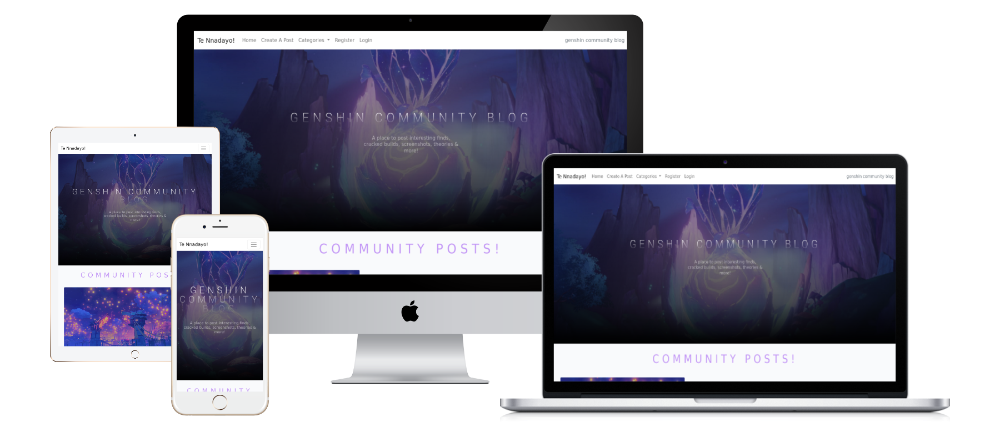
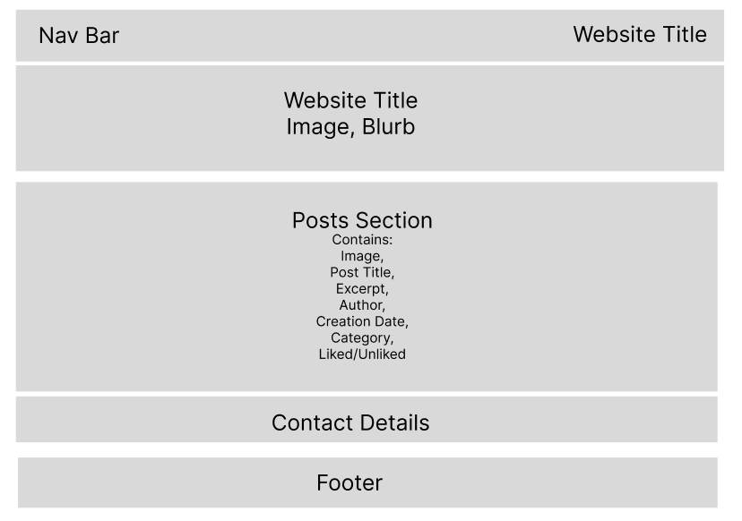

# Genshin Community Blog

[Deployed Site](https://genshin-blog-project.herokuapp.com/)

*In this ReadMe, I use Genshin Impact, and the abbreviated Genshin, interchangeably*

Due to unforeseen circumstances, time spent on this project was limited greatly. As such, there are a few CSS styling issues left unresolved. They do not impact the functionality of the site, however I am eager to fix them once I have completed this course to maximize the visual aspects of this site.

# Table of Contents
- [Introduction](#introduction)
- [UX](#ux)
    - [User Stories](#user-stories)
    - [Admin Stories](#admin-stories)
- [Development](#development)
- [Strategy](#strategy)
- [Target Audiences](#target-audiences)
- [The Website Should...](#the-website-should-allow-users-to)
- [Sprints](#sprints)
- [Scope](#scope)
- [Skeleton](#skeleton)
- [Design](#design)
    - [Colours](#colors)
    - [Header](#header)
    - [Fonts](#fonts)
    - [Images](#images)
- [Features](#features)
    - [Nav Bar](#nav-bar)
    - [Header](#header)
    - [Contact](#contact)
    - [Footer](#footer)
    - [Site Pagination](#site-pagination)
    - [Home Page](#home-page)
    - [Posts](#posts)
    - [Categories](#categories-page)
    - [Create Post](#create-post-page)
    - [Edit & Delete posts](#edit--delete-pages)
    - [Notification Pop-up](#notification-pop-up)
    - [Login/Logout Pages](#login-page)
- [Future Features](#future-features)
- [Issues/Bugs](#issuesbugs)
- [Technologies Used](#technologies-used)
- [Testing](#testing)
    - [User Stories](#user-stories-1)
    - [Admin Stories](#admin-stories-1)
    - [Other Testing](#other-manual-testing)
- [Code Validation](#code-validation)
- [Deployment](#deployment)
- [Cloning](#cloning)
- [Credits](#credits)

## **Introduction**

This blog was created for my fourth project in Code Institute's Full-Stack Software Development Course.
It is a blog for Genshin Impact players to come together and share their experiences with the game, whatever they may be. 
Users can create, edit & delete their own posts, and interact with others' posts, too!

## UX

## **User Stories, summarised (see Project)**

- As a Site User I can browse a paginated list of posts so that I can see all posts on the blog.
- As a Site User I can browse individual categories so that I can find posts related to my topic of interest.
- As a Site User I can register an account so that I can create posts and like & comment on other posts.
- As a Site User I can edit and delete my own posts.
- As a Site User I can click on posts so that I can view the full content and the comment discussion.
- As a Site User I can comment on posts so that I can talk to others & share my experiences with the game.
- As a Site User I can like/unlike posts so that I can interact with other content.
- As a Site User I can view contact information so I can get in touch with the site's owners.

## **Admin Stories**

- As a Site Admin I can view posts in an editor so that I can manage the blog's content effectively.
- As a Site Admin I can view & approve comments before they are posted so that I can moderate content on the site.
- As a Site Admin I can manage the categories list so that I can respond to User feedback.
- As a Site Admin I can view and manage the list of site users

## **Development**

This site is loosely based on inspiration from Reddit feeds and the HoyoLab website (a website by the game's creators for players of their two related games), however time constraints and abilities altered the finished outcome.

## **Strategy**

My aim with this website was to create an easily navigatable, minimilistic site for casual blogging by Genshin players.
Whilst the main goal is sharing content, it could also be used as a means for players to keep track of their favourite moments, build highlights and more.

## **Target audiences**

- Players of Genshin Impact
- People looking for a new game to play that has a healthy community

## **The website should allow Users to**:

- Browse posts and narrow by category
- Create an account
- Create, edit and delete posts
- Like and comment on posts from other Users

## The website should allow the Admin to:

- View all posts
- Manage comments on posts
- Override user authentication to delete posts which violate the idea of a healthy community

## **Sprints**

Sprint One – Admin – Two Days

The first area to focus on was setting up the admin side. This involved ensuring the authorised admin has full CRUD functionality over the site’s content (posts, comments, likes, categories) so the site can be effectively and safely managed. 

The admin needs to be able to:
- See all content on the site
- Control post and comment visibility
- See likes on posts
- Edit and update categories list

Relevant user stories:
- As a site admin, I can view all users of the site so that I can control their active status
    - The site admin can see a full list of all users of the site and click the ‘active’ button to control their status

- As a site admin, I can view all posts and control them in an editor, including deletion, so I can effectively manage the site’s content
    - The site admin can navigate to ‘posts’ under the ‘blog’ subsection and view a list of all posts

- Through this, the admin can review their published status, creation date, content, creator and interaction counts
    - As a site admin, I can view all comments on posts so I can manage user interactions and ensure safe conduct

- The site admin can navigate to ‘comments’ under the ‘blog’ subsection and view all comments and their associated posts and users
    - Through this, the admin can monitor user comments to ensure they are acceptable and relevant

- As a site admin, I can view and edit the categories so I can respond to user feedback and add more as necessary
    - The site admin can navigate to ‘categories’ under the ‘blog’ subsection and view and edit the available categories list
    - Through this, the admin can respond to user feedback regarding category relevancy and optimisation

Sprint Two – General – Two days

Sprint Three – Authentication – Two days

The third area was authentication – allowing users to create accounts and displaying their status in the navbar

Requirements for this section:
- Users should be able to create accounts by following the register button in the navbar
- Users should be automatically logged in upon account creation
- The navbar should be responsive and display to the user whether they are logged in
- Users should be able to logout once logged in

Relevant user stories:
- As a site user, I can create an account so I can interact further with the community
    - Through the register link in the navbar, users can create accounts and be automatically logged in so they can begin sharing content and interacting with others’ content

- As a site user, I can see whether I am logged in so I am always aware of my access status
    - The navbar is responsive and displays register/login/logout dependent on the user’s status
    - This makes it easy for users to know whether they are able to create, comment or like on posts, and login/create an account if they have not already

Sprint Four – Post Creation – Two Days

Relates to the ‘Create A Post’ page. 

Requirements for this section:
- Users should be able to create posts
- Users should be able to upload images to their posts
- Users should be able to assign categories to their posts

Relevant user stories:
- As a site user, I can create posts so that I can share content with the community
    - Logged in users can click on ‘Create A Post’ to begin creating a new post to share

- As a site user, I can assign my posts to categories so they are easier for others to find
    - Inside ‘Create A Post’, users can assign their post to the most relevant category

- As a site user, I can add images to my posts so I can make them more interesting
    - Inside ‘Create A Post’, users can click ‘choose file’ to upload an image
    - If no image is manually provided, there will be a default one

Sprint Five – Posts Interactions – Two days

This section focussed on allowing users to interact with posts through commenting and liking. This improves the user experience of the site by allowing users to give feedback

Requirements for this section:
- Users can browse posts by category to find relevant content
- Logged in users should be able to like and unlike posts
- Logged in users should be able to comment on posts

Relevant user stories:
- As a site user, I can search for posts by category so I can find what I’m looking for easier
    - Dropdown and individual category pages available

- As a site user, I can click on a post so I can view more of its content, including comments
    - Clicking a post navigates the user to the full content page

- As a site user, I can like posts so I can give creators my feedback
    - Logged in users can click the heart icon to like a post, and again to unlike it

- As a site user, I can comment on posts so I can interact with the community
    - Logged in users can comment on posts, and then view their comments under the post’s content

Sprint Six – Edit & Delete posts – One Day

This small sprint involved allowing users to edit and delete their posts. Only logged in users who own the post should be permitted access to these functions. 

Requirements for this section:
- Under a post a logged in user owns, they should be able to click on edit and delete options to complete the relevant actions
- The edit option should allow users full editing control over all the sections available in the create post page
- The delete option should fully remove the user’s post from the site, with confirmation to prevent a miss-click
- Logged out users, or users who do not own the post, should not be permitted access to these buttons or relevant URLs

Relevant user stories:
- As a site user, I can edit my posts so I can control them after creation
    - By clicking the edit button, users are navigated to an edit page displaying a full form for them to edit any areas of the post they so wish

- As a site user, I can delete my posts so I can remove them if desired
    - By clicking the edit button, users are presented with a confirmation message which, if clicked, immediately removes their post from the site

## **Scope**

Priority scoring ensured the most important features made their way into the finished site.

### The UX must:

- Allow Users to seamlessly navigate throughout the website's features
- Allow Users to create an account
- Allow Users to create posts
- Allow Users to browse all posts
- Allow Users to comment & like on other posts
- Be responsive across all device sizes

### The UX should:

- Allow Users to edit & delete their posts if authorised
- Allow Users to browse posts by category

### The UX may (future implementation):

- Provide Users with contact information for the site's owners
- Allow Users to update their password
- Allow Users to create accounts with social media

## **Skeleton**

All pages follow the same basic setup, with the central section changing according to the page's contents. The Wireframe created using Figma.

## **Design**

Various styling elements were taken from the free Bootstrap template Greyscale (link in credits section)

### **Colors**

My theme with the webpages I have created thusfar is purples, blues and black. For this site, as Genshin Impact is an incredibly bright game, I chose to scrap the black and stick to purples, blues, white and light-grey.
As this site is heavily image-based, a white background best displays the images, and aids in accessibility when using purples.

### **Header**

The header is the main feature of each page, with a full-width image and gradient text. For this reason, I chose a purple-themed image and white text to contrast the other headings on the pages.

### **Fonts**

I have used some harsher fonts on websites in the past, however for this site I chose to stick with gentler fonts. 
The fonts used were Roboto and Lato, from Google Fonts.

### **Images**

Users can upload their own images when publishing to the site; otherwise, a default image will load onto their post. This image is editable at any point using the Edit Post function.

## **Features**

### **Nav Bar**

The navigation bar features an oft-memed quote from the game ('Te Nnadayo'), links to Home, Create a Post, Categories dropdown and Register/Login/Logout, as well as the site's name on the far right.
On smaller screens, the navigation bar condenses into a full dropdown menu.
The navigation menu features on all webpages, and the Login link alters depending on the User's login status.
The Categories dropdown becomes a link to a full categories page when the User is not on the homepage.

### **Header**

The header features the site's name and a small extract summarising the purpose of the site. It is backed by a themed image taken from the most recent expansion in-game.
This features on every page.

### **Contact**

The contact page contains the contact details for my previous fictional gaming club site, Gay Street Games.
This features on every page.

### **Footer**

The footer is simple, with a short text on the creator and links to social network homepages.
This features on every page.

### **Site Pagination**

When a page has more than six posts, a button is added above the contact section to allow Users to navigate through the pages.

### **Home Page**

The homepage features the full directory of all posts on the blog.

### **Posts**

### Posts on Homepage

- Image
- Title & Extract - clickable link to full post content
- Date and time of creation
- Number of likes displayed as a heart icon with a number
- Author name
- Category

### Post on Individual Posts page

- Title
- Author
- Date & time of creation
- Category
- Image
- Content
- Likes and Comments, displayed as icons with numbers. Like icon will be filled in if the User has liked the post
- Edit & Delete buttons
- Comments
- Comment form

### Post on Category page

- Image
- Title - clickable link to full post content

### **Categories Page**

The categories page displays a list of all the currently created categories by the Site Admin. If more are added, this will dynamically update.
If a category is empty, a message will display informing the User of this.

### **Create Post Page**

Contains a form for Users to create their posts with. 
- Required Fields:
    - Title
    - Category (dropdown)
    - Content
    - Image (will be the default image if one is not uploaded)
- Optional Field:
    - Excerpt
- Other:
    - Submit button

### **Edit & Delete Pages**

These contain the same form as the Create Post page, with the button updated accordingly.

### **Notification Pop-Up**

Upon logging in/out, the User will be displayed with a pop-up message informing them of the action which will auto-dismiss after three seconds.

### **Login Page**

Allows the User to login with their credentials. If they have not yet created an account, there is a link to sign-up.
The sign-up page requires a username and repeated password, while email is optional.

### Logout Page

Follows the same formatting as the Login page & allows Users to logout.

## **Future Features**

- Sign-up with social media
- Require email on sign-up with ability for User to toggle whether they wish to receive updates on the blog
- Personal profile for Users where they can view their posts and likes
- Search bar to narrow post display further than categories allows
- Draft creation. Currently only available in Admin
- Add images to Categories page as the current list is plain - time constraints negated ability to work more on this page

## **Issues/Bugs**

- Category: general not displaying when adding links to posts from within the individual category page.
    - This was fixed by changing the name of the category to 'general stuff'
- SummerNote not loading in on website
    - This was fixed by following the directions [here](https://github.com/summernote/django-summernote) and adding '|safe' when loading in to the post_detail template.

## **Technologies Used**

- HTML5
- CSS3
- Python - Django functionality inc. models, views, urls

### Other:

- Django - used to build models, views and app urls
- Bootstrap - site responsiveness and extra design features
- Summernote - used on post creation forms for content styling
- Crispy Forms - used on create and edit forms
- Cloudinary - cloud-based storage
- ElephantSQL - database URL
- Google Fonts - provided the Roboto and Lato fonts
- Color Mind - generated color palettes
- Font Awesome - icons for likes and comments
- Figma - generated wireframe
- Website Mockup Generator - generated mockup of site responsiveness
- StartBootstrap - provided Grayscale template which I took various styling code from
- GitPod - development workspace
- Git - version control using GitPod terminal to commit and push to GitHub
- GitHub - store for website's code and content
- Heroku - hosting platform

## **Testing**

### **User Stories**

- As a Site User I can browse a paginated list of posts so that I can see all posts on the blog.
    - Created additional posts in each category to ensure pagination works throughout

- As a Site User I can browse individual categories so that I can find posts related to my topic of interest.
    - Navigated to categories from individual posts, categories dropdown and categories list page 

- As a Site User I can register an account so that I can create posts and interact with other posts.
    - Created two accounts to validate registration, login & logout

- As a Site User I can edit and delete my own posts.
    - Edit & Delete buttons available underneath posts
    - Checked editing/deleting only allowed if I was logged into the corresponding account for a post

- As a Site User I can click on posts so that view the full content and the comment discussion.
    - Title & excerpt are clickable links to full post content page
    - Clicking on a post brings User to full post content page

- As a Site User I can comment on posts so that I can talk to others & share my experiences with the game.
    - Comment form available under each post
    - Commented on posts from each account

- As a Site User I can like/unlike posts so that I can interact with other content.
    - Like icon available under each post
    - Liked and unliked posts from each account

### **Admin Stories**

- As a Site Admin I can view posts in an editor so that I can manage the blog's content effectively.
    - Can view a full list of posts in Django Admin
    - Can edit posts, including slug, author, likes and status, which are not available to regular site Users

- As a Site Admin I can view & approve comments before they are posted so that I can moderate content on the site.
    - Comments are passed to approval system before they are published
    - Approving a comment publishes it underneath the corresponding post

### **Other Manual Testing**

- Used all links in navigation bar on all pages
- Pages are responsive from large to small screens
- Social media links in footer work and open in new tabs
- Attempted to edit/delete posts when not logged in - not allowed

## **Code Validation**

- HTML5 - Passed W3C Markup Validator (did raise issues with use of {}, but none with actual HTML content)
- CSS - Passed W3C Markup Validator with no issues
- Python - Files tested with ExtendsClass - Returned no serious issues

## **Deployment**

This project was created using a GitPod workspace, commited to Git, pushed to GitHub and deployed on Heroku.

### Heroku Deployment

Steps taken:

#### Initial:

- Click New App
- Choose name and region

#### Environment Set-Up:

- Navigate to Settings > Reveal Config Vars
- Add the following:
    - DATABASE_URL - generated using ElephantSql
    - CLOUDINARY_URL - generated from Cloudinary API
    - SECRET_KEY - generated using command in terminal and hidden inside env.py file
- To settings.py in project workspace, add the following:
    - ALLOWED_HOSTS - heroku app name + localhost
    - TEMPLATES_DIR - join templates folder
    - allauth, cloudinary, summernote & crispy_forms to Installed Apps
    - SITE_ID
    - update TEMPLATES with created TEMPLATES_DIR
    - get DATABASE_URL from env.py and update DATABASES
    - STATIC_URL
    - STATICFILES_STORAGE
    - STATICFILES_DIRS
    - STATIC_ROOT
    - MEDIA_URL
    - DEFAULT_FILE_STORAGE
- Create Procfile
    - web: gunicon project-name.wsgi
- Imports
    - Import relevant content, e.g. django, crispy-forms, summernote etc.

#### Deployment

- Navigate to Deploy
- Link GitHub account and select relevant repository
- Click Manual Deploy, then enable Automatic Deployments

## **Forking/Cloning**

To clone this repo and run it locally on your device:

- Either fork directly from the repository, or:
    - Copy the following text: git clone https://github.com/charlie-vf/genshin-blog-project.git
    - In your terminal, change to the local directory you want to clone to
    - Paste the copied text and hit enter

## **Credits**

- All images uploaded to the site were found on Google.
- [Grayscale](https://startbootstrap.com/theme/grayscale) free Bootstrap template
- Some CSS styling taken from I Think Therefore I Blog walkthrough
    - Without time constraints, this would have been edited out & replaced with own styling
- Helpful [videos](https://www.youtube.com/@Codemycom) for troubleshooting categories creation
- [Summernote](https://github.com/summernote/django-summernote) help
- The other students in Slack and my amazing mentor

## **Deployment Resubmission Note**

- As no changes were made to the actual code of the site, the Heroku site has not been redeployed following Project & README alterations
